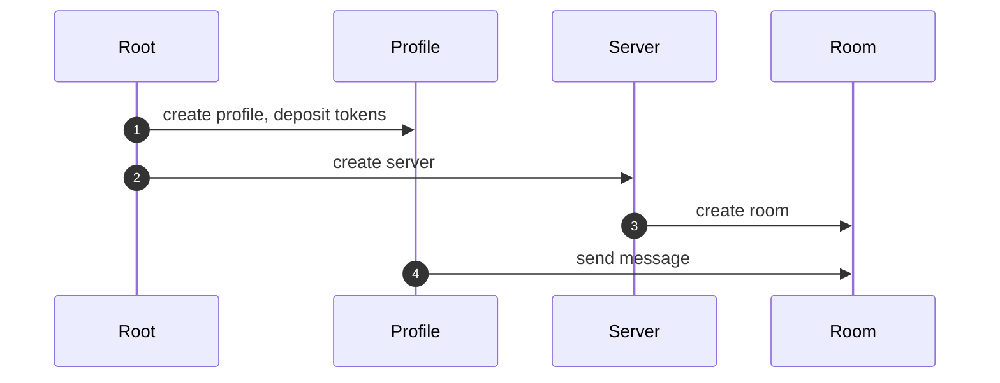
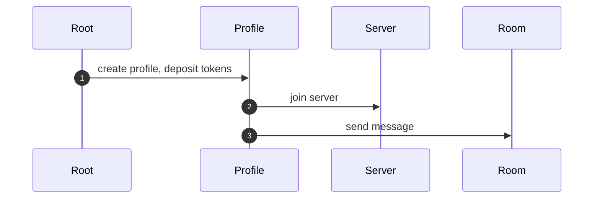

# Qupe

Qupe - protocol for building public web3 social/media platforms on top of TVM (Venom/Everscale) blockchains

[//]: # (todo naming)

Project Github: [https://github.com/tonred/Quashers](https://github.com/tonred/Quashers)

Website: [https://chat.qu.pe/main/c/0/0](https://chat.qu.pe/main/c/0/0)

Demo: [https://demo](https://demo)

[//]: # (todo menu)

## Key features:

[//]: # (todo key features)

## Qupe Protocol

### Abstract

The core of this project is the Qupe Protocol - a public web3 communication protocol.
It defines four main entities: Roots, Servers, Rooms, and Profiles, along with their interactions.
The source code for the smart contracts can be found in the [abstract folder](contracts/entities/abstract).

[//]: # (todo diagram)

### Entities

#### Root
The Root is an object that stores the code of servers, rooms, and profiles.
It is responsible for deploying new servers and profiles.
It's important to note that rooms are deployed by servers, not by the root itself.

#### Server
A Server is an independent entity that can have several rooms.
It acts as a unifying unit for multiple rooms.
The server has customizable permission controls, which are explained further in the [Permissions](#permissions) section.

#### Room
A Room is a place where users can communicate with each other.
It accepts messages from users and manages them.
Like servers, rooms also have customizable permission controls.

#### Profile
A Profile represents a user account.
It holds the user's balance of VENOM and TIP3 tokens, which are used to pay fees for publishing messages.
The profile stores user information, a list of connected servers, permissions, and other relevant data that may vary across different implementations.

### Messages

#### Storage
By default, the Qupe Protocol does not utilize a separate smart contract for storing messages.
Instead, messages are stored as hashes of [incoming message in blockchain](https://testnet.venomscan.com/messages).
This approach ensures fast and cheap message delivery, as users do not need to deploy new smart contracts for each message or maintain large mappings for storage.
However, some implementations of the protocol may include a Message smart contract, such as the [Forum](#forum) implementation.

A message can have different metadata depending on the implementation.
For example, it can have text, a hash of a message it is replying to, a hash of a forwarded message, etc.

#### Tags
Each message can have a list of tagged users. This list contains user IDs and the amount of VENOM that should be sent.
Users can set a minimum value of VENOM that should be paid to them for tagging, in order to prevent spam.

### Permissions

Both servers and rooms have customizable permission controls that enable fine-grained access management within the protocol.
These permissions are set upon deployment and can be changed by the `ADMIN` later.
Additionally, the `ADMIN` has the ability to set or delete custom permissions for any user.

The following permissions are available:
* `ADMIN` - allow user to edit permissions, withdraw tokens
* `CONFIG` - allow user to change server configuration
* `BAN_UNBAN` - allow user to ban/unban other users
* `CREATE_ROOM` - allow user to create new rooms on server
* `SEND_MESSAGE` - allow user to send messages in rooms

These permissions can be combined in any way to achieve the desired access control.
The source code for managing permissions can be found in the [permissions folder](contracts/permissions),
where you can also find a library specifically created to work with permissions.

### Workflow

1) First of all, user needs to deploy a new profile using the `Root` contract.
They should also deposit some VENOM and/or TIP3 tokens to pay fees.
2) Then the user can join to server or create a new one using the `Root` contract.
3) Depending on the previous step, the user can create a new room on the server or use an existing one.
4) Finally, user can send messages in the room.

Diagram of workflow with creating new Server and Room

Diagram of workflow using existing new Server and Room

Depending on the permissions, the user can also edit permissions, ban/unban other users, and perform other actions.
Some implementations may offer additional features such as reactions and changing reputations.

[See this demo](https://demo)

## Implementations

[//]: # (todo abstract info)

### Chat

The room in this implementation is called Channel.
This is the canonical implementation of the Qupe Protocol,
featuring fast and lightweight messages that showcase all the advantages of the protocol.

Default permissions:

|         | Default                   | Creator |
|---------|---------------------------|---------|
| Chat    | `none`                    | `full`  |
| Channel | `none` or `SEND_MESSAGE`* | `full`  |
_*depends on room configuration_

Message arguments:
1) Text
2) Reply to message hash
3) Forward message hash
4) Is message highlighted
5) Tags (default feature)

### Forum

The room in this implementation is called Topic.
The main features in this implementation are reactions and reputations.
Messages in topics are deployed as separate smart contracts, allowing users to get and set reactions on them.
Another feature is that any user can upvote or downvote a message, which affects the reputation of the user.
As a result, each message has a reputation that is calculated as the sum of upvotes and downvotes on it.

Default permissions:

|       | Default        | Creator |
|-------|----------------|---------|
| Forum | `CREATE_ROOM`  | `full`  |
| Topic | `SEND_MESSAGE` | `full`  |

Message arguments:
1) Text
2) Reply to message hash
3) Forward message hash
4) Is message highlighted
5) Tags (default feature)

### Blog

The room in this implementation is called Page.
This implementation is similar to Twitter, where users can create their own blogs and post messages in them.
However, the creator of the blog does not have `ADMIN` permissions within it, so they cannot ban users or their pages.
Additionally, other users cannot send messages to other blogs, but the owner of Page can forward or reply to their messages.

Default permissions:

|      | Default       | Creator                 |
|------|---------------|-------------------------|
| Blog | `CREATE_ROOM` | `CONFIG`, `CREATE_ROOM` |
| Page | `none`        | `SEND_MESSAGE`          |

Message arguments:
1) Text
2) Reply to message hash
3) Forward message hash
4) Tags (default feature)
