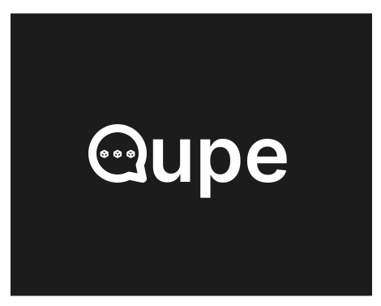

<div align="center">

[](https://qu.pe)

Qupe – protocol for building public web3 social media platforms on top of TVM blockchains (Venom/Everscale) 


<h3>

[Qupe Protocol](https://github.com/tonred/Qupe) | [Qupe Chat](https://chat.qu.pe) | [qupe-lib](https://github.com/tonred/qupe-lib) | [Demo](https://demo)

</h3>

[](https://github.com/tonred/Qupe/LICENSE)

[](https://github.com/tonlabs/TON-Solidity-Compiler/releases/tag/0.66.0)
[](https://github.com/tonlabs/TVM-linker/releases/tag/0.20.2)
[](https://github.com/broxus/locklift)

</div>


## 🚀 Key Features:

* Qupe Protocol with support for multiple implementations
* **Universal architecture** that allows you to implement a lot of different social media platforms with minimal changes
* **Fully functional MVP** consisting of the smart contract (Protocol and three implementations), web3 application [Qupe Chat](https://chat.qu.pe)
* **Fast and cheap** messages delivery solution that eliminates the need to deploy new smart contracts for each message
* **Customizable permission** controls for servers and rooms
* **Rich set of features** including tags, reactions, reputations, and more
* **Distributed architecture** optimized for the VENOM blockchain, avoiding the usage accounts with large amount of data


## 🌐 Real web3
Fully inherits the security, anonymity and speed of the Venom blockchain. Permissionless, requires no backends, custom indexers or third-party services, designed to maximise use of [RPC](https://github.com/broxus/everscale-jrpc]/GQL)/[GQL](https://github.com/tonlabs/evernode-ds), can be used with public endpoints or with own running node, without compromising user privacy.

Contracts are designed and optimised to maximise the user's response time, it feels like working with a real-time system so that the user does not feel like they are using a blockchain, fees are minimised, so that it is not expensive for users to use such platforms.

With the acceleration of block finality planned in the near future, user interactions with web3 platforms created with Qupe protocol will be much faster, even with many shards, the response time will be less than a second.

## 🧭 Navigation

* [🚀 Key Features](#-key-features)
* [🧭 Navigation](#-navigation)
* [📖 Qupe Protocol](#-qupe-protocol)
    - [Abstract](#abstract)
    - [Entities](#entities)
    - [Messages](#messages)
    - [Permissions](#permissions)
    - [Workflow](#workflow)
* [🧰 Implementations](#-implementations)
    - [💬 Chat](#-chat)
    - [🗣️ Forum](#-forum)
    - [📝 Blog](#-blog)
    - [🧱 Build Your Own](#-build-your-own)
* [🪛 Integration](#-integration)
* [🛠 Deployment](#-deployment)
    - [Requirements](#requirements)
    - [Scripts](#scripts)

## 📖 Qupe Protocol

### Abstract

The core of this project is the **Qupe Protocol** - a public web3 communication protocol.
It defines four main entities: Roots, Servers, Rooms, and Profiles, along with their interactions.
The source code for the smart contracts can be found in the [abstract folder](contracts/entities/abstract).

[//]: # (todo diagram)

### Entities

#### Root
The Root is an object that stores the code of servers, rooms, and profiles.
It is responsible for deploying new servers and profiles.
It's important to note that rooms are deployed by servers, not by the root itself.

#### Server
A Server is an independent entity that can host multiple rooms, acting as a unifying unit.
Users with the `CREATE_ROOM` permission can create new rooms within the server.
The server administrators have the ability to configure the price in VENOM or TIP3 tokens for creating new rooms.
Additionally, servers have customizable permission controls, which are further explained in the [Permissions](#permissions) section.

#### Room
A Room is a space where users can interact and communicate with each other within the Qupe Protocol.
Users with the SEND_MESSAGE permission can send messages in the room.
It accepts messages from users and manages them.
The room's administrators can configure the price in VENOM or TIP3 tokens for sending messages.
Similar to servers, rooms also have customizable permission controls.
Furthermore, rooms can have moderators who possess the `BAN_UNBAN` permission, granting them the ability to ban or unban users within the room.

#### Profile
A Profile represents a user account.
It holds the user's balance of VENOM and TIP3 tokens, which are used to pay fees for publishing messages.
The profile stores user information, a list of connected servers, permissions, and other relevant data that may vary across different implementations.

Any sending of messages to the protocol is done through an external message to the profile contract. 
It takes a hash from it and then the full message body is not sent anywhere, only its hash which can be used to [find the transaction](https://github.com/broxus/everscale-inpage-provider/blob/master/src/api.ts#L354-L378) and its message in order to read the data. 
If the message was sent through the user's wallet, the minimum we would have to pay twice action and forward fee for sending the full message body. 
It also reduces the number of hops to two, from the time the message is sent until it is accepted, which means that the maximum finality would be 2 shard blocks, optimistic 1 shard block. 


#### Vaults
Servers and Rooms within the Qupe Protocol have their dedicated vaults for storing VENOM and TIP3 tokens.
Users with the `ADMIN` permission have the ability to withdraw tokens from these vaults.
Similarly, Profiles also possess their own vaults for storing VENOM and TIP3 tokens, which are utilized for fee payments.
These vaults are designed to support multiple tokens and are referred to as MultiVaults.
Users can easily deposit and withdraw tokens from their vaults.

The source code for the vaults can be found in the [contracts/vault](contracts/vault) directory.


### Messages

#### Storage
By default, the Qupe Protocol does not utilize a separate smart contract for storing messages.
Instead, messages are stored as hashes of [external incoming message in blockchain](https://testnet.venomscan.com/messages).
This approach ensures fast and cheap message delivery, as users do not need to deploy new smart contracts for each message or maintain large mappings for storage.
However, some implementations of the protocol may include a Message smart contract, such as the [Forum](#forum) implementation.

A message can have different metadata depending on the implementation.
For example, it can have text, a hash of a message it is replying to, a hash of a forwarded message, etc.

#### Tags
Each message can have a list of tagged users. This list contains user IDs and the amount of VENOM that should be sent.
Users can set a minimum value of VENOM that should be paid to them for tagging, in order to prevent spam.


### Permissions

Both servers and rooms have customizable permission controls that enable fine-grained access management within the protocol.
These permissions are set upon deployment and can be changed by the `ADMIN` later.
Additionally, the `ADMIN` has the ability to set or delete custom permissions for any user.

The following permissions are available:
* `ADMIN` - allow user to edit permissions, withdraw tokens
* `CONFIG` - allow user to change server configuration
* `BAN_UNBAN` - allow user to ban/unban other users
* `CREATE_ROOM` - allow user to create new rooms on server
* `SEND_MESSAGE` - allow user to send messages in rooms

These permissions can be combined in any way to achieve the desired access control.
The source code for managing permissions can be found in the [permissions folder](contracts/permissions),
where you can also find a library specifically created to work with permissions.


### Workflow

1) First of all, user needs to deploy a new profile using the `Root` contract.
They should also deposit some VENOM and/or TIP3 tokens to pay fees.
2) Then the user can join to server or create a new one using the `Root` contract.
3) Depending on the previous step, the user can create a new room on the server or use an existing one.
4) Finally, user can send messages in the room.

<details open>
<summary>Diagram of workflow with creating new Server and Room</summary>


</details>

<details>
<summary>Diagram of workflow using existing new Server and Room</summary>


</details>

Depending on the permissions, the user can also edit permissions, ban/unban other users, and perform other actions.
Some implementations may offer additional features such as reactions and changing reputations.

[See this demo](https://demo)


## 🧰 Implementations

[//]: # (todo abstract info)

### 💬 Chat

The room in this implementation is called Channel.
This is the canonical implementation of the Qupe Protocol,
featuring fast and lightweight messages that showcase all the advantages of the protocol.

Default permissions:

|         | Default                   | Creator |
|---------|---------------------------|---------|
| Chat    | `none`                    | `full`  |
| Channel | `none` or* `SEND_MESSAGE` | `full`  |

_*depends on room configuration_

Message arguments:
1) Text
2) Reply to message hash
3) Forward message hash
4) Is message highlighted
5) Tags (default feature)

### 🗣️ Forum

The room in this implementation is called Topic.
The main features in this implementation are reactions and reputations.
Messages in topics are deployed as separate smart contracts, allowing users to get and set reactions on them.
Another feature is that any user can upvote or downvote a message, which affects the reputation of the user.
As a result, each message has a reputation that is calculated as the sum of upvotes and downvotes on it.

Default permissions:

|       | Default        | Creator |
|-------|----------------|---------|
| Forum | `CREATE_ROOM`  | `full`  |
| Topic | `SEND_MESSAGE` | `full`  |

Message arguments:
1) Text
2) Reply to message hash
3) Forward message hash
4) Is message highlighted
5) Tags (default feature)

### 📝 Blog

The room in this implementation is called Page.
This implementation is similar to Twitter, where users can create their own blogs and post messages in them.
However, the creator of the blog does not have `ADMIN` permissions within it, so they cannot ban users or their pages.
Additionally, other users cannot send messages to other blogs, but the owner of Page can forward or reply to their messages.

Default permissions:

|      | Default       | Creator                 |
|------|---------------|-------------------------|
| Blog | `CREATE_ROOM` | `CONFIG`, `CREATE_ROOM` |
| Page | `none`        | `SEND_MESSAGE`          |

Message arguments:
1) Text
2) Reply to message hash
3) Forward message hash
4) Tags (default feature)

### 🧱 Build Your Own
The versatile architecture allows a very large number of different platforms to be implemented. 
We have a lot of ideas for what could be done, but only the Qupe Chat for this hackathon has been fully implemented.

For example, we wanted to implement the ability to create and view small HTML/Markdown pages, similar to Telegraph, where the server is a bucket, room is a deployment, and messages is artifacts(any content, bytes, html, css, js).
A mapping can be saved in the room metadata, where the key is a path and the value is a message hash with content, like `index.html => 0xabcd....1234`.
And write a small browser, which inside the iframe will render the content, through the service worker will listen to requests, get the content from the blockchain by path and give it back in its usual form.

What else is possible build with this protocol:
 - Blogging platform like Medium, Hashnode, etc
 - Comments systems like Disqus, Cusdis
 - Content sharing platforms such as YouTube, TikTok, Instagram with external data storage like IPFS, DriveChain or any other  

## 🪛 Integration
[qupe-lib](https://github.com/tonred/qupe-lib) – a TypeScript library for easy interaction with the Qupe protocol, it can easily be expanded by adding new implementations.
The entire Qupe Chat web application is written using this library.


## 🛠 Deployment

### Requirements

Before proceeding with the deployment, make sure you have the following requirements installed:

* [nodejs](https://nodejs.org) `>=16.16.0`
* [locklift](https://npmjs.com/package/locklift) `>=2.5.5`

### Scripts

```shell
# 1) Build
npm run build
```

```shell
# 2) test
npm run test
```

```shell
# 3) Deploy Chat
npm run deploy-chat
```
